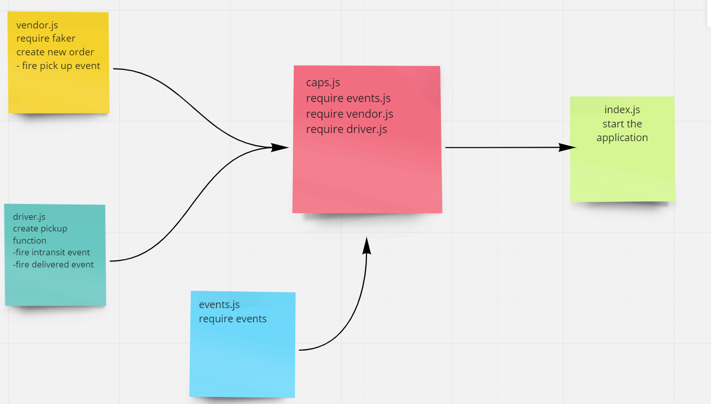

# caps

this is a event drivin application has three events:

- first to tell the the driver to pick an order up
- second so the driver tell that the order is being deliverd.
- last one so the driver confirms that the orded is delivered.

## UML:

